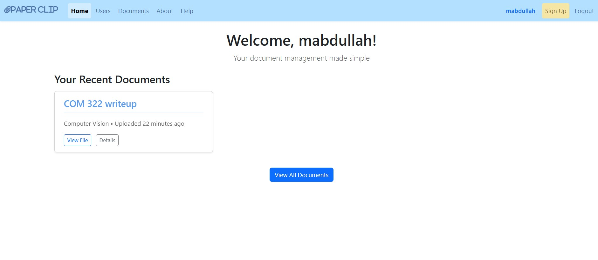
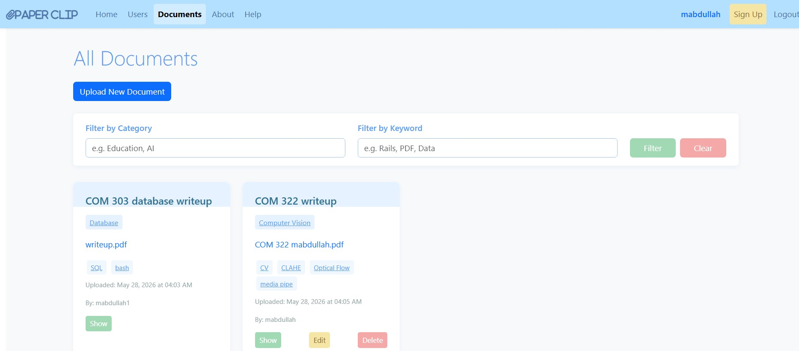
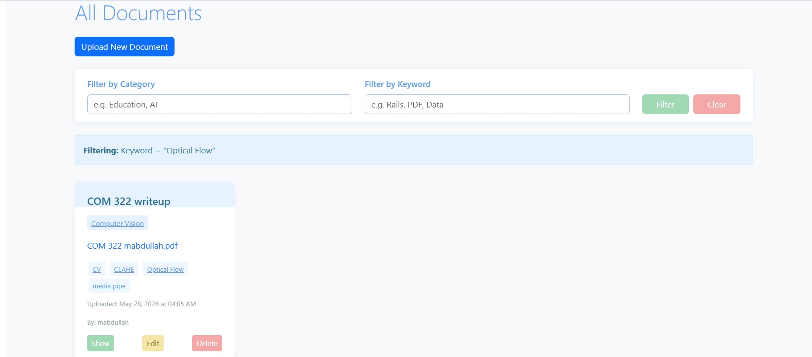
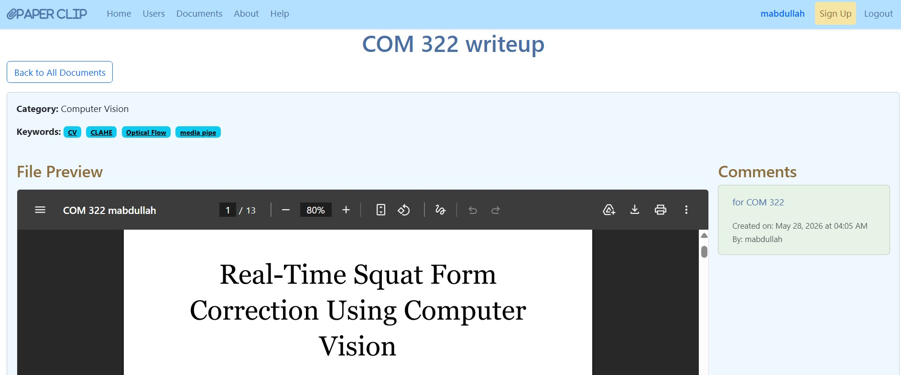
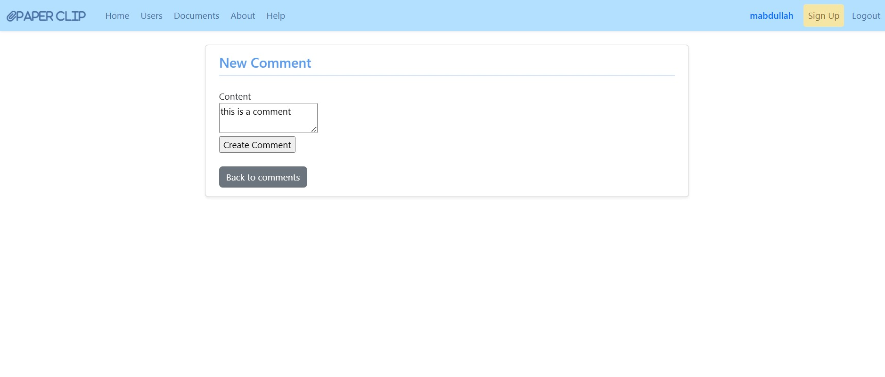
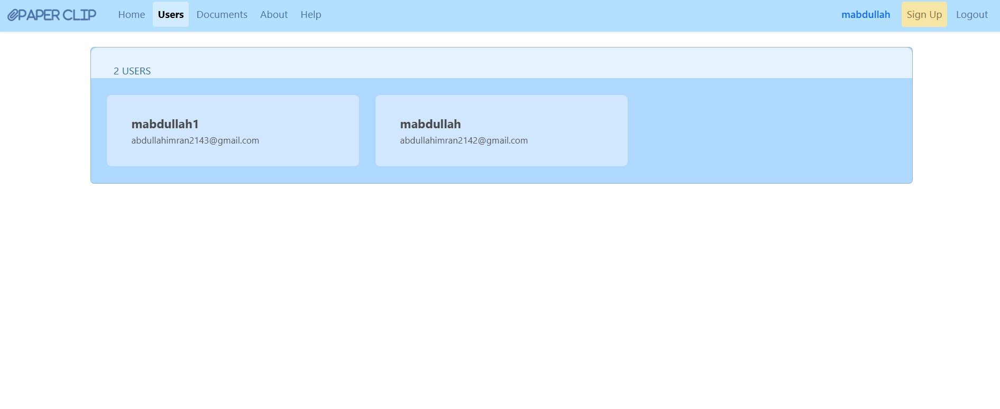
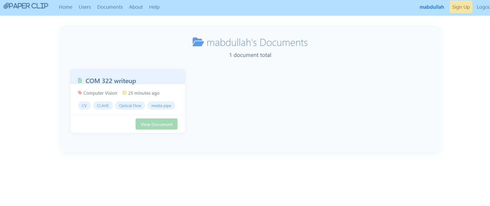
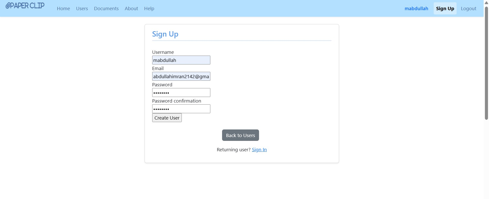
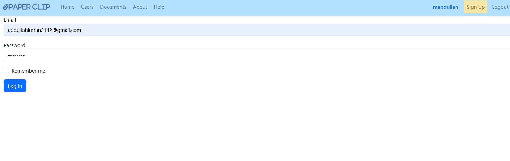

# Paper Clip

A document management web application built for Connecticut College. Users can create accounts, upload documents, browse and search the document library, and leave comments on each other's files.

Built as a final project for COM214: Web Development.

---

## Screenshots

### Home Page


### Documents Library


### Filter by Keyword


### File Details & Comments


### Writing a Comment


### User Directory


### User's Document Collection


### Sign Up


### Login


---

## Features

- **User accounts** — sign up, log in, log out, edit profile, delete account
- **Document uploads** — upload PDFs, images, and Word documents (max 10MB) stored on AWS S3
- **Document library** — browse all uploaded documents with uploader name and timestamp
- **Search & filter** — filter documents by category or keyword (case-insensitive)
- **Pagination** — documents are paginated (12 per page)
- **Comments** — logged-in users can leave comments on any document
- **Authorization** — users can only edit or delete their own documents and comments
- **Remember me** — persistent login sessions via secure cookies

---

## Tech Stack

| Layer | Technology |
|---|---|
| Framework | Ruby on Rails 7.2 |
| Database | PostgreSQL |
| File Storage | AWS S3 via Active Storage |
| Authentication | BCrypt (`has_secure_password`) |
| Styling | Bootstrap 5, Font Awesome |
| Pagination | Pagy |
| Deployment | Render |

---

## Setup (Local Development)

**Requirements:** Ruby 3.4.4, PostgreSQL, an AWS S3 bucket

1. Clone the repo and install dependencies:
   ```bash
   git clone <repo-url>
   cd COM214-Web-Development
   bundle install
   ```

2. Set up the database:
   ```bash
   rails db:create db:migrate
   ```

3. Add your AWS credentials using Rails encrypted credentials:
   ```bash
   bin/rails credentials:edit
   ```
   Add the following inside the file:
   ```yaml
   aws:
     access_key_id: YOUR_ACCESS_KEY
     secret_access_key: YOUR_SECRET_KEY
   ```

4. Update `config/storage.yml` with your S3 bucket name and region.

5. Start the server:
   ```bash
   rails server
   ```

6. Visit `http://localhost:3000`

---

## Team

Built by:
- **Max Davis**
- **Sa'ada Umaima Maliha**
- **Muhammad Abdullah**

Connecticut College — COM214: Web Development
